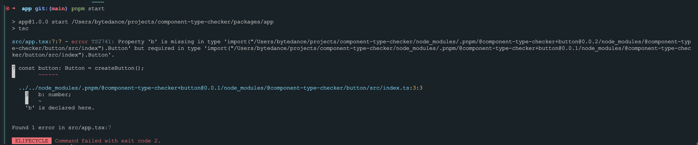
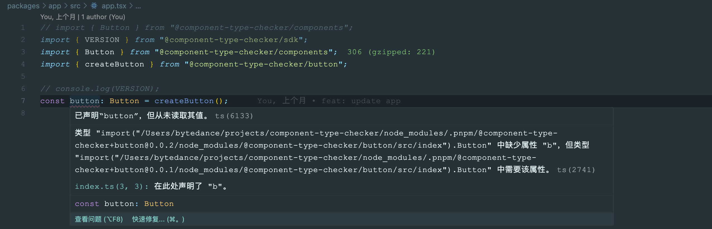
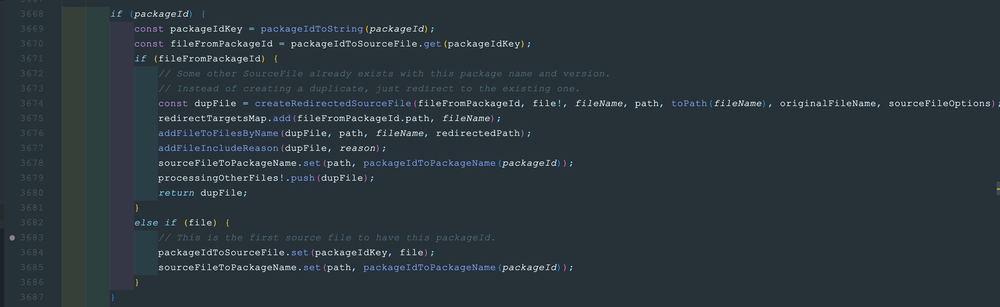
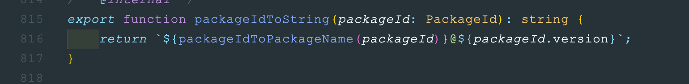
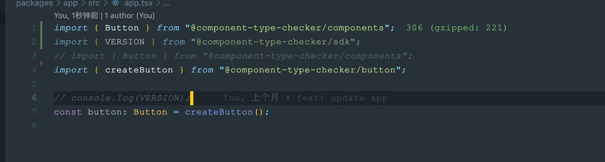

# 存在Peer依赖时，TypeScript和Pnpm一起用可能出现bug

## 背景

最近在营销域在使用@m4b-deisgn/components 时，出现一个非常奇怪的 bug——TS 会报类型错误。

为了更清晰的解释这个 bug 原理，我抽离出一个最小化的 Demo，pnpm install 后，在 app 应用下跑 pnpm start，或者利用 IDE 打开 app.tsx 都可复现问题。

报错在于存在两个 button 版本 0.0.1 和 0.0.2，当我直接从 button 包中去引入 createButton 时，这个 button 包是 0.0.2 版本的，这是合理的，因为在 app 应用中，dependencies 声明了 button 是 0.0.2 版本。

但是在 components 包中依赖的 button 是 peer 的，而且是\*的依赖，表示兼容所有版本。

按照正常 import 的逻辑，手动递归的向上寻找它的依赖，也会发现 components 正常来说引入的应该是 0.0.2 的 button 才对。

而唯一使用过 0.0.1 的 button 是在 sdk 中强依赖了button@0.0.1。

## 排查

在最初营销仓库中排查过很多因素，包括但不限于：Webpack 的 resolver 处理有问题、pnpm 不同版本在硬链接的时候会有不同的表现、pnpm 对 peer 处理有 bug、node 对于链接处理有问题、营销域里面配置了某些黑魔法、Ts 解析有 bug……………………………………

## 原因

排查过很多可能性的因素后，最终把问题定位在 ts 本身上。利用上述 Demo 复现完问题后，我拉取了 Typescript 的源码进行 debug。

Ts 在对一个项目开始检测时会调用 createProgram，然后在里面递归每一个文件对每一个文件调用 findSourceFile 去生成 SourceFile。在 findSourceFile 中也会通过 processImportedModules 对文件的 import 进行处理，在里面对每个 import 又会重新调用 findSourceFile，从而达到一个递归遍历所有文件的效果。

此时就遇到这个问题的根因——Ts 实际上会根据 Id 缓存路径。

它会在 3684 行通过 id 缓存当前的 file，当再次调用 findSourceFile 的时候，3671 的逻辑就会是 true，可以通过 3672-3673 这两行注释了解到，当 id 相同的时候他就会复制原有的 sourceFile 而不是新建。而 Id 的构建仅通过包名和版本号进行拼接。

以当前 Demo 为例：

findSourceFile app.tsx

-   findSourceFile @component-type-checker/sdk
    -   findSourceFile @component-type-checker+components@0.0.1_@component-type-checker+button@0.0.1
        -   findSourceFile @component-type-checker/button@0.0.1
-   findSourceFile @component-type-checker+components@0.0.1_@component-type-checker+button@0.0.2
    -   reuse sourceFile @component-type-checker+components@0.0.1_@component-type-checker+button@0.0.1

原因就是第一次出现 button 包是在 sdk 包的 import 中，里面的确是button@0.0.1，当再次检测到 components 包中的 button 时不会再用正常 import 的逻辑进行查找包，而是直接复用上次找到的 button 这就导致了这个问题的出现。

这也是之前为啥又不建议大家使用@m4b-design/components，因为他会乱引用的原因。

为了验证，开启 app.tsx 中的第一行注释，并注释掉第三行。

报错就消失了，因为此时第一次使用 button 是在 components 中，所以被缓存的是button@0.0.1，和项目中的 button 是同一个版本。

## 沟通

当定位到是 Ts 原因后，我给 Ts 提了个 issue，他们也的确认为这是一个 bug，并在最近提供了修复的 pr，预期等 merged 后应该能够解决。在营销仓库中，通过调换初次引入的位置也能够临时解决这个报错。

## 总结

1. Peer 依赖+Ts+Pnpm 的确有 bug。
1. ts 去 import 文件的时候会缓存，而不是普通的按照每个文件递归向上找。
1. Ts 在修了，PR 有了，但是截止文档编写时还没 merge。
1. 临时解决可以在项目入口处主动 import 一个正确路径，使 ts 缓存。
