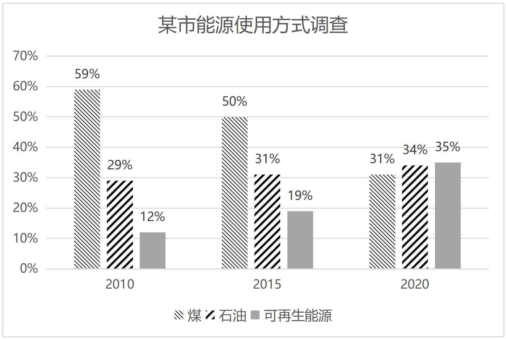

# 英语二

## 小作文

### 一

#### 题目

Suppose your foreign friend Jack is asking for your advice on writing an article about the
school’s 100th anniversary celebration. Write him an email to

1. provide your suggestions, and
2. give your reason(s). You should write about 100 words on the ANSWER SHEET. Do not use your own name. Use “Li Ming” instead. (10 points)

#### 文章

Dear Jack, It's great to hear that you're writing an article for Asia Today about our school's 100th
anniversary.I recommend focusing on the theme of "growth and innovation." Highlight how the school has evolved over the years, embracing both tradition and modernity.

For the reason, this approach will capture the readers' attention by showcasing the university’s achievement and its vision for the future. Including interviews with students and faculty could provide personal insights, making your article more relatable and engaging.

I believe these suggestions could make your article more compelling and relevant to the readers. I'm confident your article will be well-received.

Best regards,
Li Ming

#### 翻译

亲爱的杰克，

很高兴听到你正在为《今日亚洲》写一篇关于我们学校成立 100 周年的文章。我建议把重点放在“成长与创新”的主题上。突出学校多年来融合传统与现代的发展历程。

因此，这种方式将通过展示大学的成就及其对未来的愿景来吸引读者的注意力。包括对学生和教师的采访可以提供个人见解，使你的文章更具关联性和吸引力。

我相信这些建议可以使你的文章对读者更具吸引力和相关性。我有信心你的文章会受到好评。

谨上，
李明

## 大作文

### 一

#### 题目

Write an essay based on the chart below. In your essay, you should

1. describe and interpret the chart, and
2. give your comments. Write your answer in about 150 words on the ANSWER SHEET. (15 points)

#### 文章

The column chart above illustrates how different shares of energy consumption changed in a certain city. From 2010 to 2020, utilization rate of coal had shrunk from 59% to 31%, while petroleum had been employed in an ever more frequently manner, with its figure changing from 29% to 34%. The most striking part is the renewable energy which had jumped to 35% from 12%. It is evident that dramatic changes occurred in the energy use because of various reasons.

In my view, factors contributing to this phenomenon are as follows. First, government plays a decisive role in propelling correlated industry of renewable energy, it grants many entities engaged in the industry permission to promote green energy. In the second place, technological progress totally leads to these changes. For instance, electric vehicles are mostly equipped with large-capacity batteries. Imagine if a car could run over 500 miles with one time charge, why should we bother to afford an automobile which may generate much contamination? Lastly, people’s perceptions of surrounding environment are not what it used to be. We come to realize that clear waters and green mountains are as good as mountains of gold and silver; the welfare of our descendant are determined by us, therefore, we should carry out a sustainable development strategy for sake of ecological protection.

As what has been discussed above, conclusion could be drawn that the use of renewable energy is a boon and will continue to gain momentum in coming future. With its favourable effect, our society is destined to be a better one.

#### 翻译

上图显示了某个城市不同能源消耗份额的变化。从 2010 年到 2020 年，煤炭利用率从 59%下降到 31%，而石油的使用频率越来越高，从 29%下降到 34%。最引人注目的部分是可再生能源，从 12%跃升至 35%。很明显，由于各种原因，能源使用发生了巨大变化。

在我看来，造成这一现象的因素如下。首先，政府在推动可再生能源相关产业发展中起着决定性作用，它授予许多从事该行业的实体推广绿色能源的许可。其次，技术进步完全导致了这些变化。例如，电动汽车大多配备大容量电池。想象一下，如果一辆汽车一次充电可以行驶 500 多英里，我们为什么要费心买一辆可能产生大量污染的汽车呢？最后，人们对周围环境的看法已经不是以前的样子了。我们意识到，碧水青山和金山银山一样好；子孙后代的福祉取决于我们，因此，为了生态保护，我们应该实施可持续发展战略。

如上所述，可以得出结论，可再生能源的使用是一个福音，并将在未来继续获得动力。
有了它的积极影响，我们的社会注定会变得更好。
